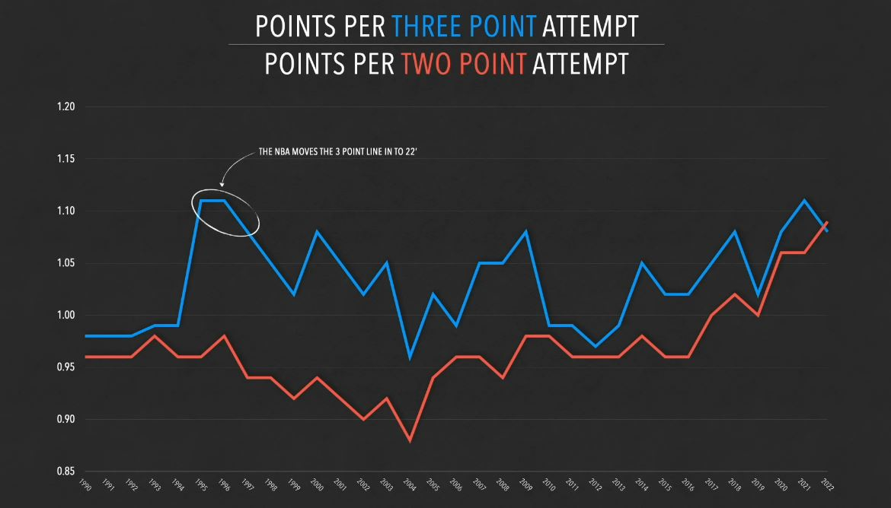

# Data Storytelling

Data storytelling is a technique that consists of creating a narrative through visual clues such as graphs, key points, and statistics to communicate how the data behaves and how we could use it for practical purposes.
It is the process of translating a complex data set into a more cohesive, compelling and understandable story for an outside audience and ourselves.
The goal is to interpret a data set and make it more accessible and memorable.

## The Money Ball (The winning percentage)

We're on the hot beach of Oakland in the 2000s, and the Major League Baseball (MLB) Oakland Athletics had a surprising idea.
They wanted to try to optimize spending and winning through only statistics and apply it to their recruiting strategies.
The concept worked so well that it got its own book, "Moneyball: The Art of Winning an Unfair Game," which was later adapted into a film starring Brad Pitt as the team's general manager (GM).

### The Story

The Oakland Athletics had a new head coach and were faced with major financial constraints, but the coach, Billy Beane, didn't let it go.
Beane thought that another approach could help them, an approach that money can't buy.
As of today, sports analytics are really common, but back in the time, we could only rely on basic stats like field goals and "the eye test", just looking at if a player seems good.
The Athletics' management decided to focus on statistical metrics to try and determine undervalued players on the market.

### Key Principles of MoneyBall

#### On-Base Percentage (OBP)
The ability of a player to get on base is measured by his on-base percentage. Which was a revolution in looking at offensive outputs compared to batting average.

#### Value of Undervalued Players
Spend small, win big. This was meant to cut some spending on the budget and to optimize an untapped market of players that didn't seem like they had potential, but the advanced stats backed up the opposite.

#### Data-Driven Decision-Making 
The Money Ball was the new hype; it was against all the previous models, which took a strictly statistical approach to running a team with smart player recruitment and in-game strategies.

## The 3 point shot

We're in the 1960s in the United States, in the American Basketball Association (ABA). Basketball was a sport of big men; a big man is a 200-cm player playing as a center.
The sport revolved around getting the ball to a rim that is 305cm high, and since the place where you have the highest percentage of accuracy is close to the hoop.
The sport was still centered around centers. So they decided to add a rule. They drew a line at 730cm from the hoop and declared that from now on, every shot taken from behind this line will count for 3 instead of the traditional 2 points for any field goals or 1 for every free throw (a shot granted after a shooting foul).
The purpose of this 3-point line was to create specialized players that would have another weapon in their arsenal, where taking that shot from far away could finally be worth the risk.
The story is where it should have been placed. How would they know that this here isn't too far and too close, and will people ever get too good at this where the game could only be decided by that?
Well, this is why, when the ABA merged with the National Basketball Association (NBA), they were reluctant to introduce the shot. After further inspection and tracking, the distance of every player's shot location and accuracy.
As of today, even as players have become more efficient and simply more skilled than before, the 3-point line is deemed balanced because a field goal from close to the rim will always have more chances to go in.
The current standard for the NBA is about 33% accuracy from the 3-point line and 54% from inside. This would make a 3-point shot worth about 1.1 points per attempt and a 2-pointer worth about 0.98 per attempt.
Even as recently as players are taking more 3 pointers than ever, this  trend always stayed until recently when 3 pointers became so dominant that teams just started to make adjustments, and as of today, a 2 pointer is worth 1.12 and a 3 pointer is worth 1.09. 
Magically, it was like a stroke of genius; that arbitrary line they drew 60 years ago was accurate.
And the statistics backed it up. The 3-point line was a genius addition because the more defenses focused on defending 3-pointers, the fewer people were inside, which made scoring from inside easier.
It was a simple rule that happened to be balanced by numbers.